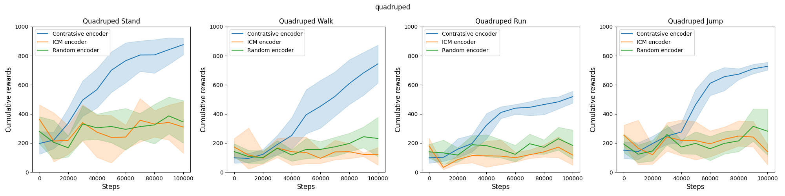

# Analyze the state encoder of BeCL

This code evaluates the impact of different state encoders in downstream tasks in URLB. This codebase is built on top of the [Unsupervised Reinforcement Learning Benchmark (URLB) codebase](https://github.com/rll-research/url_benchmark) and follows its requirement. 

Overall, in the pretraining stage, we replace the contrastive learning state encoder (original implementation in BeCL) with other encoders including Intrinsic Curiosity Module (ICM) and random network. These encoders are implemented in `\agent`. 

Specifically, ICM trains two networks $f(a_t |s_t,s_{t+1})$  and $f(s_{t+1} | s_t, a_t)$.  $f(a_t |s_t,s_{t+1})$ encodes the states $s_t, s_{t+1}$ into the features $f(s_t),f(s_{t+1})$. it is trained to predict $a_t$,  and $f(s_{t+1} | s_t, a_t)$ takes as inputs $f(s)$ and $a_t$ to predict the feature representation $f(s_{t+1})$ of $s_{t+1}$.  Also, a random network encoder aims at initializing a network and encodes the $s_t$ into the feature $f(s_t)$ when pretraining, and its number of layers is the same as BeCL.  We emphasize that the only difference between the implementation is from the structure of the encoder and its loss function. The output of the state encoder would be used to compute the BeCL reward signal to train skill policy. 

We evaluate the qualitative results of the pre-trained state encoders in different downstream quadruped tasks in URLB: 



The results that the contrastive encoder we introduced in our paper performs best than other alternative encoders. ICM encoder and random encoder both fail to converge in the finetuning stage. 

To test the experiment, run the following command to pre-train the state encoder:

``` sh
#Contrastive encoder:
python pretrain.py agent=becl domain=quadruped seed=3

#ICM encoder
python pretrain.py agent=icm_becl domain=quadruped seed=3

#Random network
python pretrain.py agent=random_encoder_becl domain=quadruped seed=3
```

For testing the performance of different state encoders in downstream tasks, run the following command to fine-tune policies:

```sh
python finetune.py task=quadruped_stand obs_type=states agent=becl reward_free=false seed=3 domain=walker snapshot_ts=2000000
```

This will load a snapshot stored in `./models/states/walker/{encoder_name}/3/snapshot_2000000.pt`, initialize `DDPG` with it (both the actor and critic),  and start training on `quadruped_stand` using the extrinsic reward of the task. 
